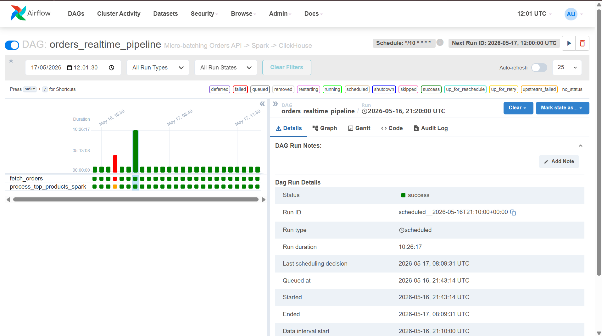
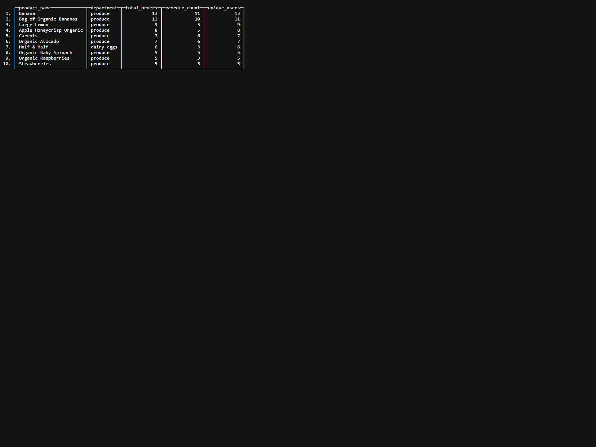
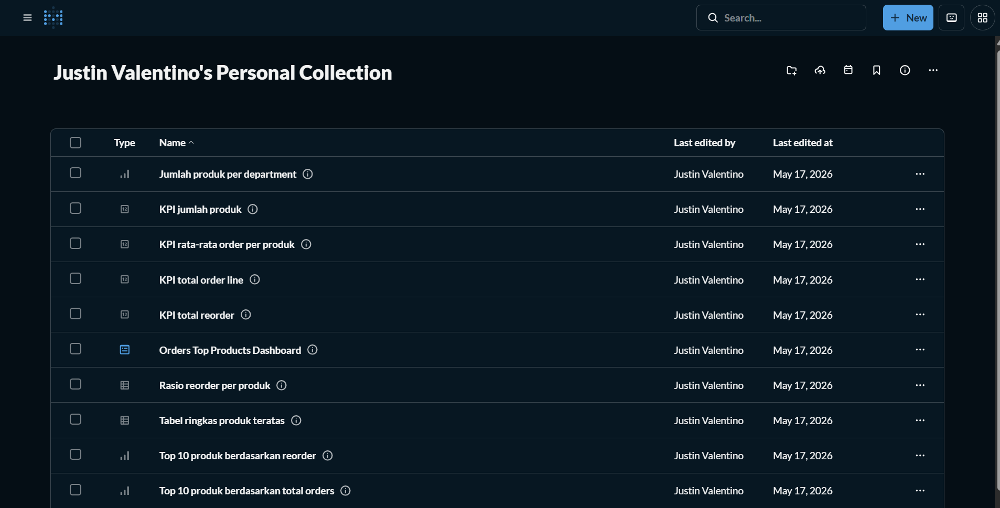
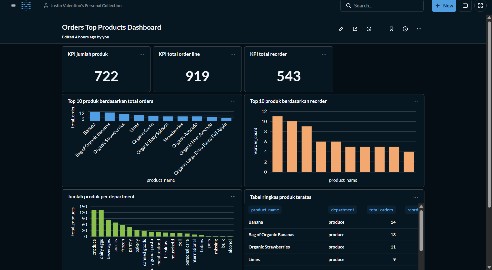

# MCI2026 Task 2 - Kelompok 34

## Anggota Kelompok
Justin Valentino 

Agil Lukman

## Tujuan Proyek
Proyek ini dibuat untuk memenuhi tugas Pipeline Orchestration & Data Visualization menggunakan dataset orders dari:

`http://96.9.212.102:8000/orders`

Target utama proyek:
- merancang DAG Apache Airflow
- memproses dan memuat data ke ClickHouse
- membuat Questions di Metabase
- membangun Dashboard di Metabase

## Arsitektur Pipeline
Alur data pada proyek ini adalah:

1. Airflow menjalankan DAG `orders_realtime_pipeline` setiap 10 menit.
2. Task `fetch_orders.py` mengambil data orders dari API.
3. Data di-flatten menjadi satu baris per pasangan order-produk.
4. Data hasil flatten disimpan ke file Parquet pada data lake lokal.
5. Task `process_orders_spark.py` membaca file Parquet menggunakan Spark.
6. Spark melakukan agregasi metrik per produk.
7. Hasil agregasi dimuat ke ClickHouse pada tabel `analytics.orders_top_products`.
8. Metabase membaca tabel tersebut untuk visualisasi dan dashboard.

## Penjelasan Komponen
### Apache Airflow
Airflow digunakan untuk mengatur orkestrasi pipeline. DAG hanya memiliki dua task utama:
- `fetch_orders`
- `process_top_products_spark`

### Apache Spark
Spark digunakan untuk membaca file Parquet dan menghitung agregasi per produk:
- `total_orders`
- `reorder_count`
- `unique_users`

### ClickHouse
ClickHouse berfungsi sebagai analytical database untuk menyimpan hasil agregasi akhir yang siap dibaca Metabase.

### Metabase
Metabase digunakan untuk membuat Questions dan Dashboard berdasarkan tabel hasil pipeline di ClickHouse.

## Struktur Folder
```text
MCI2026_Task2_Kelompok34/
|-- dags/
|   |-- orders_pipeline.py
|   `-- scripts/
|       |-- fetch_orders.py
|       `-- process_orders_spark.py
|-- screenshots/
|-- docker-compose.yml
|-- Dockerfile
|-- requirements.txt
|-- sql-clickhouse.sql
|-- sql-metabase.sql
`-- README.md
```

## Langkah Menjalankan Proyek
1. Buka terminal pada folder proyek.
2. Jalankan bootstrap Airflow terlebih dahulu:

```bash
docker compose up --build airflow-init
```

3. Setelah `airflow-init` selesai, jalankan seluruh service:

```bash
docker compose up -d
```

4. Pastikan container aktif dengan:

```bash
docker compose ps -a
```

5. Buka Airflow pada `http://localhost:8080`.
6. Login dengan kredensial default yang ada pada `docker-compose.yml`.
7. Aktifkan DAG `orders_realtime_pipeline`.
8. Jalankan DAG secara manual atau tunggu jadwal eksekusi.
9. Buka ClickHouse untuk memverifikasi data sudah masuk ke tabel.
10. Buka Metabase pada `http://localhost:3000`.
11. Tambahkan koneksi ke ClickHouse dan gunakan query pada `sql-metabase.sql`.

## Schema Tabel ClickHouse
Tabel utama yang digunakan:

`analytics.orders_top_products`

Kolom:
- `product_name String`
- `department String`
- `total_orders Int32`
- `reorder_count Int32`
- `unique_users Int32`

DDL lengkap tersedia pada file [sql-clickhouse.sql](./sql-clickhouse.sql).

## Questions Metabase
Query Questions disimpan di [sql-metabase.sql](./sql-metabase.sql) dan mencakup:
- KPI jumlah produk
- KPI total order line
- KPI total reorder
- KPI rata-rata order per produk
- top 10 produk berdasarkan total orders
- top 10 produk berdasarkan reorder
- top 10 produk berdasarkan unique users
- jumlah produk per department
- total orders per department
- rasio reorder per produk
- tabel ringkas produk teratas

## Rancangan Dashboard Metabase
Dashboard final yang disarankan terdiri dari:
- 3 KPI cards:
  - jumlah produk
  - total orders
  - total reorder
- 2 bar charts:
  - top produk terlaris
  - top produk dengan reorder tertinggi
- 1 department chart:
  - distribusi produk per department atau total orders per department
- 1 table card:
  - daftar produk teratas dengan kolom `product_name`, `department`, `total_orders`, `reorder_count`, `unique_users`

## Hasil dan Screenshot
Tambahkan screenshot hasil eksekusi pada folder `screenshots/` dengan nama berikut:
- `airflow-dag.png`
- `clickhouse-table.png`
- `metabase-questions.png`
- `metabase-dashboard.png`

Tempatkan screenshot pada bagian ini saat proyek sudah dijalankan:

### Screenshot Airflow DAG


### Screenshot ClickHouse


### Screenshot Questions Metabase


### Screenshot Dashboard Metabase


## Kesimpulan
Proyek ini menunjukkan implementasi pipeline data sederhana dari API orders ke ClickHouse menggunakan Airflow dan Spark, lalu divisualisasikan menggunakan Metabase. Struktur proyek sudah dipisahkan antara orchestration, transformasi, penyimpanan analitik, dan dokumentasi sehingga mudah direview dan dikembangkan lebih lanjut.
